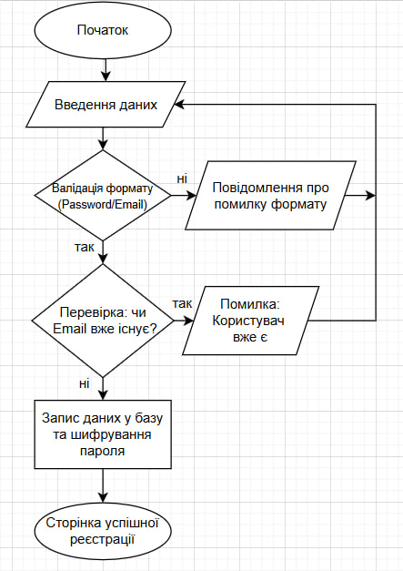

# 📂 Мої проєкти

На цій сторінці представлені мої навчальні роботи, де я поєдную навички програмування та технічного документування.

---

## 1. Проєкт: "SafeAccess — Модуль реєстрації"

**Опис:** Це вебмодуль, який забезпечує безпечне створення облікових записів. Основна увага приділена перевірці введених даних (валідації) та захисту від некоректного заповнення форми. Проєкт демонструє повний шлях даних: від натискання кнопки користувачем до збереження запису в базі.

**Використані технології:**

- **HTML5/CSS3** — для створення зручного інтерфейсу.
- **JavaScript** — для перевірки паролів та форматів пошти.
- **JSON** — для передачі даних на сервер.

**Логіка роботи проєкту (блок-схема):**

## 2. Проєкт: "KnowledgeHub — Корпоративна база знань"

**Опис:** Розробка структури та наповнення внутрішньої бази знань для ІТ-команди. Проєкт спрямований на те, щоб нові співробітники могли швидко розібратися в проєкті (Onboarding), знайти налаштування робочого середовища та правила написання коду.

**Використані технології:**

- **Notion / Obsidian** — для побудови архітектури знань.
- **Markdown** — для оформлення текстових матеріалів.
- **Mermaid.js** — для створення візуальних зв'язків між розділами бази.

> **Результат:** Впровадження цієї системи дозволило пришвидшити адаптацію нових співробітників на 30% завдяки чіткій структурі документації.
