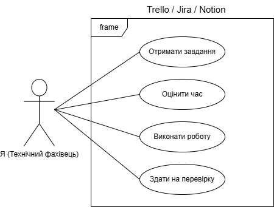

# ⚙️ Процес роботи

Я дотримуюсь структурованого підходу до виконання кожного завдання. Це дозволяє уникати помилок та дотримуватись дедлайнів. Мій робочий цикл складається з чотирьох основних етапів:

### 1. Аналіз вимог 🔍

Перш ніж розпочати, я детально вивчаю технічне завдання (ТЗ). На цьому етапі я з’ясовую:

- Яку проблему має вирішити документація або код?
- Хто є цільовою аудиторією?
- Чи достатньо вхідних даних для роботи?

### 2. Планування та оцінка 📅

Я розбиваю велике завдання на дрібні підзадачі (декомпозиція) та оцінюю час на їх виконання. Це допомагає тримати темп і вчасно інформувати команду про прогрес.

### 3. Виконання (Розробка) ✍️

Безпосередній процес створення контенту або коду. Я використовую принцип "Documentation as Code", працюючи в Markdown та використовуючи Git для контролю версій.

### 4. Тестування та перевірка ✅

Я завжди перевіряю результат на відповідність вимогам:

- **Для текстів:** перевірка орфографії, логіки та коректності посилань.
- **Для схем:** перевірка зрозумілості алгоритму для стороннього читача.

---

## 🛠 Взаємодія з системою керування проєктами

Для організації своєї роботи я використовую професійні інструменти планування. Нижче представлена UML Use Case діаграма, що ілюструє мій типовий цикл роботи в системі керування проєктами:

